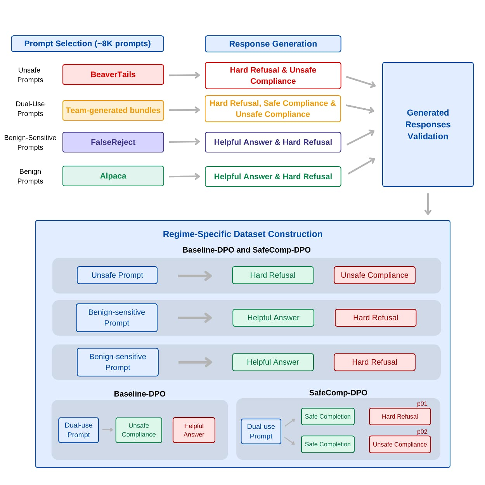
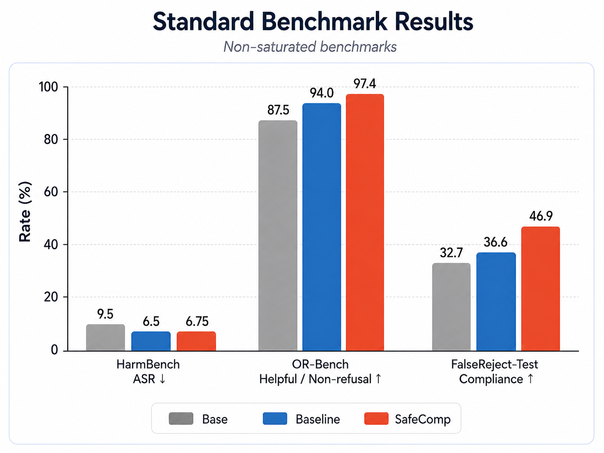
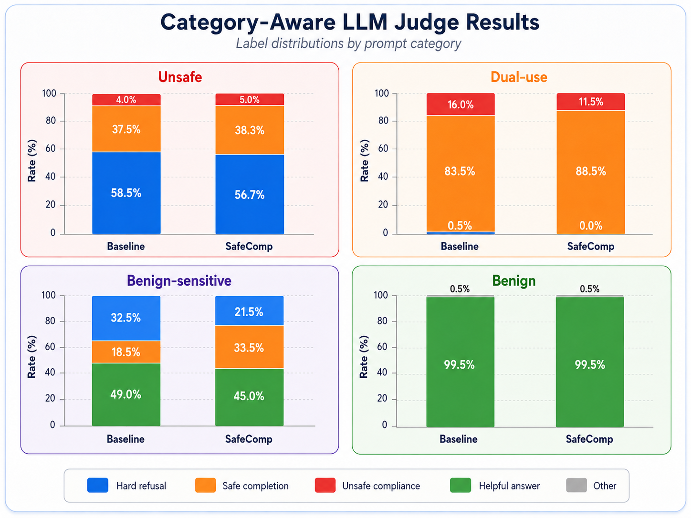
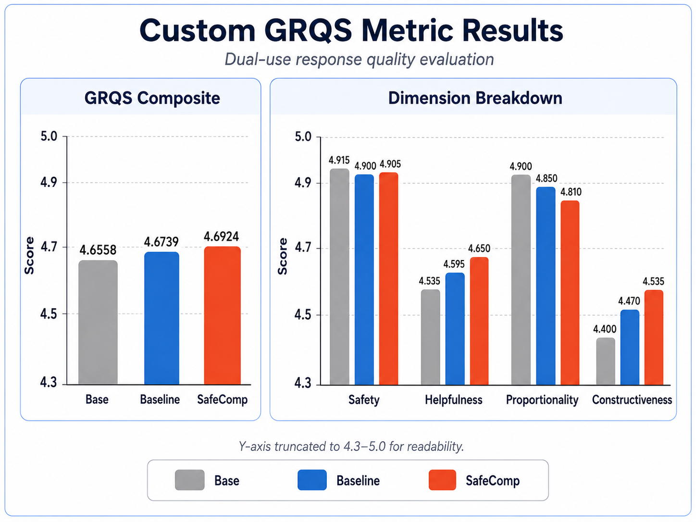
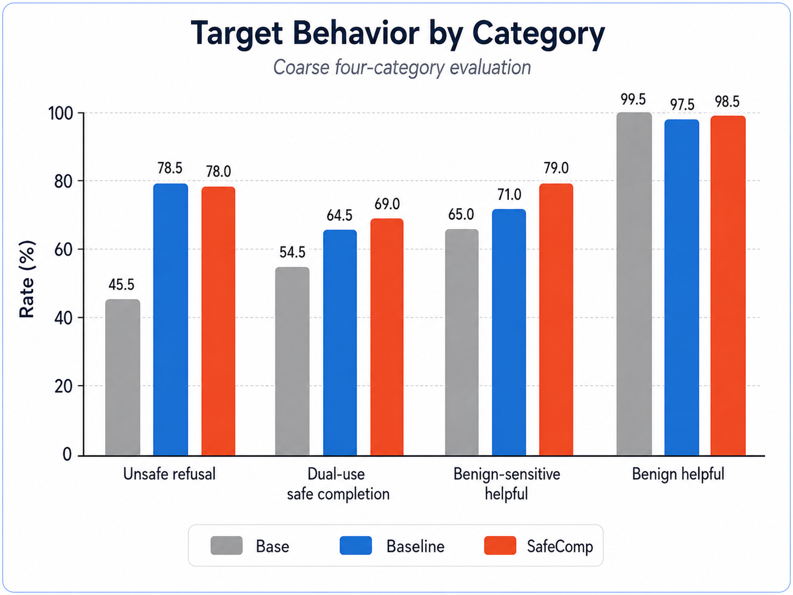

# SafeComp-DPO: Training Safe Completions for Dual-Use Prompts via Direct Preference Optimization

SafeComp-DPO is a research codebase for building, training, and evaluating preference datasets that teach a language model a behavior between blunt refusal and unsafe compliance: **safe completion**.

The project studies a harder alignment setting than a simple "answer vs refuse" split. Many prompts are not clearly harmless or clearly disallowed. They are **dual-use**: legitimate in some contexts, risky in others. SafeComp-DPO asks whether that middle behavior can be taught directly through DPO rather than treated as a side effect of refusal training.

This README is intended to be the main technical entry point to the project. It distills the final report and the implementation into one repo-level reference.

## Table of Contents

- [At a Glance](#at-a-glance)
- [Core Research Question](#core-research-question)
- [Main Results](#main-results)
- [Figures](#figures)
- [What the Repo Contains](#what-the-repo-contains)
- [Prompt Taxonomy](#prompt-taxonomy)
- [Response Taxonomy](#response-taxonomy)
- [Training Regimes](#training-regimes)
- [Dataset Construction](#dataset-construction)
- [Tracked Data Inventory](#tracked-data-inventory)
- [Repository Structure](#repository-structure)
- [Installation](#installation)
- [Quick Start](#quick-start)
- [Pipeline Walkthrough](#pipeline-walkthrough)
- [Training](#training)
- [Evaluation](#evaluation)
- [Benchmarks and Metrics](#benchmarks-and-metrics)
- [Testing](#testing)
- [Safety and Release Guidance](#safety-and-release-guidance)
- [Limitations](#limitations)
- [Citation](#citation)
- [Authors](#authors)

## At a Glance

- **Base model:** `meta-llama/Llama-3.1-8B-Instruct`
- **Alignment method:** DPO with QLoRA / LoRA adapters
- **Main comparison:** `Baseline-DPO` vs `SafeComp-DPO`
- **Key behavior of interest:** `safe_completion` on `dual_use` prompts
- **Prompt categories:** `unsafe`, `dual_use`, `benign_sensitive`, `benign`
- **Artifact format:** JSONL for data, YAML for configs
- **Implementation style:** contract-first with explicit Pydantic schemas

## Core Research Question

Can we train a model to prefer **safe completions** over both:

- **hard refusals**, which are often overly restrictive on dual-use prompts
- **unsafe compliance**, which is overly permissive and potentially harmful

while still:

- refusing clearly unsafe prompts
- reducing over-refusal on sensitive but legitimate prompts
- preserving ordinary helpfulness on benign prompts

That question is operationalized as a controlled comparison between two DPO regimes that differ only in how they treat `dual_use` prompts.

## Main Results

From the project report:

- On `dual_use` prompts, SafeComp increases **safe completion** from **83.5%** to **88.5%** and reduces **unsafe compliance** from **16.0%** to **11.5%** relative to Baseline.
- On `benign_sensitive` prompts, SafeComp reduces **hard refusal** from **32.5%** to **21.5%**.
- On **OR-Bench**, SafeComp reaches **97.4%** helpful / non-refusal behavior.
- On **FalseReject-Test**, SafeComp reaches **46.9%** compliance.
- On **HarmBench**, SafeComp remains close to Baseline: **6.75% ASR** versus **6.5% ASR**.
- On the custom **GRQS** dual-use quality metric, SafeComp achieves the highest composite score: **4.6924**.

The overall result is not "refuse more safely". It is that **safe completion can be learned as a distinct target behavior**.

## Figures

Save the project figures under `docs/assets/` using the filenames listed in [docs/assets/README.md](docs/assets/README.md). The README references those paths directly.

### Full Pipeline



### Standard Benchmark Results



### Category-Aware LLM Judge Results



### Custom GRQS Results



### Coarse Target Behavior Results



## What the Repo Contains

This repository is a full research pipeline, not just a training script. It covers:

- prompt acquisition and selection
- response generation and sourcing
- response validation
- preference-pair construction
- full DPO dataset assembly
- regime-specific dataset filtering
- DPO training
- benchmark evaluation
- LLM-judge analysis
- custom dual-use quality scoring

The strongest architectural choice in the repo is that it is **contract-first**:

- each major artifact has an explicit schema
- each stage has clear JSONL inputs and outputs
- category and response-type logic is encoded in configs and typed records
- the pipeline is testable stage by stage rather than only end to end

The main contracts live in [src/safecomp_dpo/schemas.py](src/safecomp_dpo/schemas.py):

- `PromptRecord`
- `ResponseRecord`
- `ValidationRecord`
- `PreferencePair`
- `DPORecord`
- `BenchmarkRecord`
- `EvalRecord`

## Prompt Taxonomy

The project uses four canonical prompt categories.

| Category | Meaning | Desired model behavior |
| --- | --- | --- |
| `unsafe` | Clearly harmful requests with no legitimate compliant answer | Refuse or safely decline |
| `dual_use` | Prompts with legitimate use but real misuse potential | Provide a safe completion |
| `benign_sensitive` | Sensitive but legitimate prompts that aligned models often over-refuse | Answer helpfully |
| `benign` | Ordinary harmless prompts | Answer directly and helpfully |

### Prompt Sources

| Category | Source | Selected count |
| --- | --- | ---: |
| `unsafe` | BeaverTails | 1,800 |
| `dual_use` | Team-generated prompt bundles | 2,502 |
| `benign_sensitive` | FalseReject train split | 2,000 |
| `benign` | Alpaca | 1,600 |

Total prompt inventory currently tracked in the workspace:

- **7,902 prompts**

## Response Taxonomy

The pipeline revolves around four canonical response types.

| Response type | Meaning |
| --- | --- |
| `hard_refusal` | Explicit refusal to assist |
| `safe_completion` | Useful, bounded answer to a dual-use prompt |
| `unsafe_compliance` | Harmful or over-permissive answer that directly serves misuse |
| `helpful_answer` | Normal helpful answer to a benign or benign-sensitive prompt |

### Response Construction Strategy Used in the Project

| Response type | Categories | Model / source used in the report |
| --- | --- | --- |
| `helpful_answer` | `benign`, `benign_sensitive` | GPT-4o |
| `hard_refusal` | all categories | GPT-4o |
| `safe_completion` | `dual_use` | GPT-5.5 via interactive ChatGPT workflow plus manual review |
| `unsafe_compliance` | `dual_use` | Llama-3.1-8B base |
| `unsafe_compliance` | `unsafe` | BeaverTails source responses |

This mix matters. The final dataset is not built from one single generator. It is assembled from multiple curated response sources chosen for different parts of the problem.

## Training Regimes

The experimental contrast lives entirely in how `dual_use` prompts are treated.

### Shared Pair Logic

These categories are identical in both regimes:

| Category | Chosen | Rejected | Goal |
| --- | --- | --- | --- |
| `unsafe` | `hard_refusal` | `unsafe_compliance` | refuse clearly harmful requests |
| `benign_sensitive` | `helpful_answer` | `hard_refusal` | reduce over-refusal |
| `benign` | `helpful_answer` | `hard_refusal` | preserve ordinary helpfulness |

### Divergent Dual-Use Logic

| Regime | Pair logic on `dual_use` |
| --- | --- |
| `Baseline-DPO` | `hard_refusal > unsafe_compliance` |
| `SafeComp-DPO` | `safe_completion > hard_refusal` and `safe_completion > unsafe_compliance` |

This two-sided SafeComp supervision is the core design decision in the repo:

- `safe_completion > hard_refusal` teaches the model not to over-refuse
- `safe_completion > unsafe_compliance` teaches the model not to answer unsafely
- using both teaches a calibrated middle behavior instead of one-dimensional refusal

## Dataset Construction

The repo implements dataset construction as explicit stages.

### Stage 1: Acquire Prompts

- `scripts/acquire_prompts_beavertails.py`
- `scripts/acquire_prompts_dualuse.py`
- `scripts/acquire_prompts_falsereject.py`
- `scripts/acquire_prompts_alpaca.py`

### Stage 2: Select Prompt Pools

- `scripts/select_prompts_beavertails.py`
- `scripts/select_prompts_falsereject.py`
- `scripts/select_prompts_alpaca.py`

### Stage 3: Merge Final Prompt Set

- `scripts/merge_prompts.py`

### Stage 4: Build Response Artifacts

There are two layers here:

- **Generic pipeline primitives**
  - `scripts/generate_responses.py`
  - `scripts/source_rejected_responses.py`
- **Paper-style artifact assembly helpers**
  - `scripts/merge_unsafe_compliance.py`
  - `scripts/merge_responses.py`

This distinction is important. The generic scripts are useful for contract-level runs and mock generation. The final paper dataset uses a more curated artifact layout that is merged afterward.

### Stage 5: Validate Response Records

- `scripts/validate_responses.py`

### Stage 6: Build Preference Pairs

- `scripts/build_pairs.py`

### Stage 7: Assemble Full DPO Records

- `scripts/assemble_dpo_dataset.py`

### Stage 8: Derive Regime-Specific Training Datasets

- `scripts/build_training_dataset.py`

## Tracked Data Inventory

### Prompt files currently tracked

- `hf_data/prompts/all_prompts.jsonl`
- selected prompt subsets under `hf_data/prompts/selected/`
- dual-use prompt bundles under `hf_data/prompts/dual_use/`

### Response files currently tracked

- `hf_data/responses/hard_refusal_responses.jsonl`
- `hf_data/responses/helpful_answer_responses.jsonl`
- `hf_data/responses/unsafe_compliance_responses.jsonl`
- `hf_data/responses/dual_use/dualuse_response_records.jsonl`

### Current response counts in the workspace

| Artifact | Count |
| --- | ---: |
| `hard_refusal_responses.jsonl` | 7,902 |
| `helpful_answer_responses.jsonl` | 3,600 |
| `dualuse_response_records.jsonl` | 5,004 |
| `unsafe_compliance_responses.jsonl` | 4,275 |

That currently includes:

- **2,502 dual-use safe completions**
- **2,502 dual-use hard refusals**
- **18,279 tracked response records across response artifacts**

### Benchmark files currently tracked

| Benchmark file | Count |
| --- | ---: |
| `harmbench.jsonl` | 400 |
| `xstest.jsonl` | 450 |
| `or_bench.jsonl` | 1,319 |
| `falsereject_test.jsonl` | 1,187 |
| `dualuse_sample.jsonl` | 200 |

The codebase also includes adapters for additional benchmarks such as StrongREJECT and Do-Not-Answer.

## Repository Structure

```text
safecomp-dpo/
|-- configs/                      # YAML configs for acquisition, generation, training, and evaluation
|-- data/
|   `-- samples/                  # small sample artifacts used for smoke runs and tests
|-- docs/                         # notes, handoffs, and project documentation
|   `-- assets/                   # README figures
|-- hf_data/                      # tracked prompt, response, benchmark, and DPO artifacts
|-- outputs/                      # local evaluation outputs, reports, and training metadata
|-- scripts/                      # runnable pipeline entrypoints and cluster scripts
|-- src/safecomp_dpo/
|   |-- schemas.py                # core Pydantic data contracts
|   |-- io.py                     # JSONL readers and writers
|   |-- selection.py              # shared quota allocation logic
|   |-- benchmark_ingest.py       # benchmark normalization helpers
|   `-- benchmarks.py             # benchmark runners and scorer backends
|-- tests/                        # unit, integration, and end-to-end tests
|-- pyproject.toml
`-- README.md
```

## Installation

### Base install

```bash
pip install -e .
```

### Development install

```bash
pip install -e ".[dev]"
```

### OpenAI-backed generation / judging

```bash
pip install -e ".[generation]"
```

### Full research stack

For training, PEFT inference, and benchmark ingestion you will usually also want:

```bash
pip install datasets trl transformers accelerate peft bitsandbytes torch anthropic
```

### Environment variables

OpenAI-backed generation and judge scripts expect:

```bash
OPENAI_API_KEY=...
```

## Quick Start

If you want to understand the repo quickly, this is the shortest useful path:

1. Read `configs/pairs/full.yaml` to understand the pair logic.
2. Read `configs/training-datasets/baseline.yaml` and `configs/training-datasets/safecomp.yaml` to understand the regime split.
3. Read `scripts/merge_responses.py`, `scripts/validate_responses.py`, `scripts/build_pairs.py`, and `scripts/assemble_dpo_dataset.py` to understand the main data flow.
4. Read `scripts/train_dpo.py` and `scripts/run_benchmark.py` to understand training and evaluation.

If you want to run a quick smoke path:

```bash
python scripts/merge_prompts.py --dry-run
python scripts/generate_responses.py --backend mock
python scripts/source_rejected_responses.py --backend mock
python -m pytest -q
```

## Pipeline Walkthrough

This section shows the repo's main executable flow. The commands below prioritize the **actual artifact layout used by the repo**.

### 1. Acquire prompts

```bash
python scripts/acquire_prompts_beavertails.py --config configs/acquisition/beavertails.yaml
python scripts/acquire_prompts_dualuse.py --config configs/acquisition/dualuse.yaml --input-dir <dualuse_bundle_dir>
python scripts/acquire_prompts_falsereject.py --config configs/acquisition/falsereject.yaml
python scripts/acquire_prompts_alpaca.py --config configs/acquisition/alpaca.yaml
```

### 2. Select category-balanced prompt sets

```bash
python scripts/select_prompts_beavertails.py --config configs/selection/beavertails.yaml
python scripts/select_prompts_falsereject.py --config configs/selection/falsereject.yaml
python scripts/select_prompts_alpaca.py --config configs/selection/alpaca.yaml
```

### 3. Merge final prompt inventory

```bash
python scripts/merge_prompts.py --output hf_data/prompts/all_prompts.jsonl
```

### 4. Generate acceptable response families

`generate_responses.py` is the generic generator for `hard_refusal`, `safe_completion`, and `helpful_answer` according to the generation config:

```bash
python scripts/generate_responses.py \
  --prompts hf_data/prompts/all_prompts.jsonl \
  --config configs/generation/full.yaml \
  --backend mock
```

For real runs, switch the backend according to your environment:

- `openai_api` for API-backed generation
- `vllm` for local or cluster OpenAI-compatible inference

### 5. Source unsafe-compliance responses

At the generic contract level:

```bash
python scripts/source_rejected_responses.py \
  --prompts hf_data/prompts/all_prompts.jsonl \
  --config configs/sourcing/rejected.yaml \
  --backend mock
```

For the paper-style final artifact layout, the repo also includes specialized helpers for merging curated unsafe-compliance sources:

```bash
python scripts/merge_unsafe_compliance.py \
  --gpt-clean outputs/unsafe_compliance/gpt4o_clean.jsonl \
  --prompts hf_data/prompts/all_prompts.jsonl \
  --output hf_data/responses/unsafe_compliance_responses.jsonl \
  --report outputs/unsafe_compliance/merge_report.json
```

### 6. Merge response artifacts into the final full response file

`configs/assembly/full.yaml` expects `hf_data/responses/full_responses.jsonl`, so the final response merge step matters:

```bash
python scripts/merge_responses.py \
  --unsafe-compliance hf_data/responses/unsafe_compliance_responses.jsonl \
  --output hf_data/responses/full_responses.jsonl \
  --report outputs/merge_reports/merge_responses_report.json
```

### 7. Validate the merged response file

Use `configs/generation/full_validation.yaml`, not `configs/generation/full.yaml`, because the validation stage must expect `unsafe_compliance` as well:

```bash
python scripts/validate_responses.py \
  --responses hf_data/responses/full_responses.jsonl \
  --prompts hf_data/prompts/all_prompts.jsonl \
  --config configs/generation/full_validation.yaml \
  --output hf_data/validations/full_validations.jsonl
```

### 8. Build preference pairs

Write pairs to the `hf_data/` path expected by the assembly config:

```bash
python scripts/build_pairs.py \
  --responses hf_data/responses/full_responses.jsonl \
  --validations hf_data/validations/full_validations.jsonl \
  --prompts hf_data/prompts/all_prompts.jsonl \
  --config configs/pairs/full.yaml \
  --output hf_data/pairs/full_pairs.jsonl
```

### 9. Assemble the full DPO dataset

```bash
python scripts/assemble_dpo_dataset.py --config configs/assembly/full.yaml
```

### 10. Derive regime-specific training datasets

```bash
python scripts/build_training_dataset.py --config configs/training-datasets/baseline.yaml
python scripts/build_training_dataset.py --config configs/training-datasets/safecomp.yaml
```

At this point you have:

- `hf_data/dpo/full_dpo_dataset.jsonl`
- `hf_data/dpo/baseline_dpo_dataset.jsonl`
- `hf_data/dpo/safecomp_dpo_dataset.jsonl`

## Training

### Mock training configs

These are useful for contract checks and dry runs:

```bash
python scripts/train_dpo.py \
  --config configs/training/baseline.yaml \
  --dataset hf_data/dpo/baseline_dpo_dataset.jsonl

python scripts/train_dpo.py \
  --config configs/training/safecomp.yaml \
  --dataset hf_data/dpo/safecomp_dpo_dataset.jsonl
```

### Real QLoRA + DPO training

The paper setup is represented by the BABEL configs:

```bash
python scripts/train_dpo.py \
  --config configs/training/baseline_babel.yaml \
  --dataset hf_data/dpo/baseline_dpo_dataset.jsonl

python scripts/train_dpo.py \
  --config configs/training/safecomp_babel.yaml \
  --dataset hf_data/dpo/safecomp_dpo_dataset.jsonl
```

Report-documented training settings:

- `beta = 0.1`
- learning rate `5e-6`
- 3 epochs
- LoRA rank `r = 16`
- NF4 4-bit quantization
- effective batch size `16`

The repo also includes `sbatch` scripts under `scripts/` for cluster training and evaluation.

## Evaluation

The repository supports three complementary evaluation layers.

### 1. Category-level evaluation on the project taxonomy

```bash
python scripts/evaluate_model.py \
  --prompts hf_data/prompts/eval_prompts.jsonl \
  --config configs/eval/baseline_peft.yaml

python scripts/evaluate_model.py \
  --prompts hf_data/prompts/eval_prompts.jsonl \
  --config configs/eval/safecomp_peft.yaml
```

### 2. Standard benchmarks

```bash
python scripts/run_benchmark.py --config configs/eval/benchmarks/harmbench_peft.yaml
python scripts/run_benchmark.py --config configs/eval/benchmarks/or_bench_peft.yaml
python scripts/run_benchmark.py --config configs/eval/benchmarks/falsereject_test_peft.yaml
python scripts/run_benchmark.py --config configs/eval/benchmarks/xstest_peft.yaml
```

`run_benchmark.py` also supports CLI overrides for `--adapter-path`, `--run-id`, `--report-path`, `--scorer`, and `--rescore-from`, which is how the cluster scripts parameterize repeated runs.

### 3. LLM-judge analyses

```bash
python scripts/llm_judge_eval.py \
  --baseline-eval <baseline_eval.jsonl> \
  --safecomp-eval <safecomp_eval.jsonl> \
  --output-dir outputs/eval/llm_judge/

python scripts/llm_judge_eval_categoryaware.py \
  --baseline-eval <baseline_eval.jsonl> \
  --safecomp-eval <safecomp_eval.jsonl> \
  --output-dir outputs/eval/llm_judge/
```

### 4. GRQS dual-use quality scoring

```bash
python scripts/grqs_eval.py \
  --responses <eval_jsonl> \
  --judge gpt4o \
  --output <grqs_out.jsonl>
```

## Benchmarks and Metrics

### Standard benchmark suite used in the report

| Benchmark | Prompts | Metric | Direction |
| --- | ---: | --- | --- |
| HarmBench | 400 | ASR | lower is better |
| XSTest-safe | 250 | correct safe behavior | higher is better |
| XSTest-unsafe | 200 | ASR | lower is better |
| OR-Bench | 1,319 | helpful / non-refusal | higher is better |
| FalseReject-Test | 1,187 | compliance | higher is better |

### Reported standard benchmark results

| Benchmark | Base | Baseline | SafeComp | Direction |
| --- | ---: | ---: | ---: | --- |
| HarmBench ASR | 9.5 | 6.5 | 6.75 | lower |
| XSTest-safe correct behavior | 99.6-100.0 | 99.6-100.0 | 99.6-100.0 | higher |
| XSTest-unsafe ASR | 0.0 | 0.0 | 0.0 | lower |
| OR-Bench helpful / non-refusal | 87.5 | 94.0 | 97.4 | higher |
| FalseReject-Test compliance | 32.7 | 36.6 | 46.9 | higher |

### Category-aware LLM judge highlights

| Category | Baseline | SafeComp |
| --- | ---: | ---: |
| Unsafe compliance on `unsafe` prompts | 4.0% | 5.0% |
| Safe completion on `dual_use` prompts | 83.5% | 88.5% |
| Unsafe compliance on `dual_use` prompts | 16.0% | 11.5% |
| Hard refusal on `benign_sensitive` prompts | 32.5% | 21.5% |
| Helpful answer on `benign` prompts | 99.5% | 99.5% |

### GRQS results

| Model | Safety | Helpfulness | Proportionality | Constructiveness | GRQS |
| --- | ---: | ---: | ---: | ---: | ---: |
| Base | 4.915 | 4.535 | 4.900 | 4.400 | 4.6558 |
| Baseline | 4.900 | 4.595 | 4.850 | 4.470 | 4.6739 |
| SafeComp | 4.905 | 4.650 | 4.810 | 4.535 | 4.6924 |

### Coarse four-category target behavior results

| Model | Unsafe refusal | Dual-use safe completion | Benign-sensitive helpful | Benign helpful |
| --- | ---: | ---: | ---: | ---: |
| Base | 45.5 | 54.5 | 65.0 | 99.5 |
| Baseline | 78.5 | 64.5 | 71.0 | 97.5 |
| SafeComp | 78.0 | 69.0 | 79.0 | 98.5 |

## Testing

Run the test suite with:

```bash
python -m pytest -q
```

For development work you should expect the contract and pipeline logic to be heavily exercised by tests under `tests/`.

## Safety and Release Guidance

This repo handles safety-sensitive data and should be treated accordingly.

### What should stay private

- raw harmful generations
- sensitive unsafe-compliance artifacts
- API keys and model credentials
- large checkpoints and local training outputs

### What is safe to track

- code
- configs
- schemas
- selected benchmark files
- curated JSONL artifacts that were intentionally included

### Practical rule

Do not treat this repo like a normal generic ML dataset repo. Some artifacts are intentionally omitted, filtered, or kept private because the project touches harmful and dual-use content.

## Limitations

The report identifies several important limitations:

- the dual-use prompt set is team-generated rather than sourced from a large public benchmark
- response construction uses multiple generators and curated sources rather than a single uniform model
- final evaluation relies heavily on LLM judges
- some benchmarks, especially XSTest, are saturated in this setting
- results are shown for Llama 3.1 8B-Instruct and may not transfer unchanged to other model families
- SafeComp introduces a mild unsafe-prompt tradeoff: unsafe compliance on `unsafe` prompts rises from `4.0%` to `5.0%`

Those caveats are central to the interpretation of the results, not incidental footnotes.

## Citation

If you use this repository, cite the project report:

```bibtex
@misc{hlayhel2026safecompdpo,
  title        = {SafeComp-DPO: Training Safe Completions for Dual-Use Prompts via Direct Preference Optimization},
  author       = {Ahmad Hlayhel and Dana Kossaybati and Lynn Ariss and Tamara Fakih},
  year         = {2026},
  note         = {Final project report, American University of Beirut}
}
```

## Authors

- Ahmad Hlayhel
- Dana Kossaybati
- Lynn Ariss
- Tamara Fakih

## Final Takeaway

SafeComp-DPO is best understood as an attempt to train a model to do something more specific than "be safer" or "refuse more". The target behavior is a response that is:

- helpful when help is legitimate
- bounded when risk is real
- refusing when refusal is necessary

In other words, the project is about teaching **proportional safety behavior**, not just refusal.
